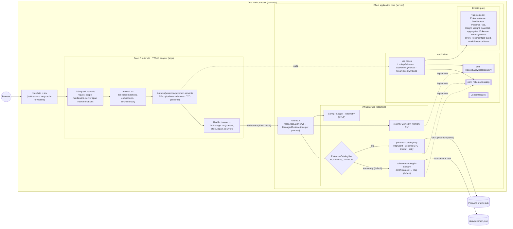

# Pokédex: Effect v4 + React Router v8

A small, production-shaped proof of concept. The feature is deliberately trivial (a Pokémon lookup backed
by [PokeAPI](https://pokeapi.co)). What matters is the architecture: **React Router v8 (framework mode)
is a thin HTTP/UI adapter, and Effect v4 is the application core.** It ships as one deployable: one Node
process, one container image.

| Package                                                   | Version (pinned exactly)                                                 |
| --------------------------------------------------------- | ------------------------------------------------------------------------ |
| `effect`, `@effect/vitest`                                | `4.0.0-rc.117` (lock-stepped, enforced by `scripts/check-boundaries.ts`) |
| `react-router`, `@react-router/node`, `@react-router/dev` | `8.4.0`                                                                  |
| React                                                     | `19.3.0`                                                                 |
| Vite / Vitest / Playwright                                | `8.3.1` / `5.0.2` / `1.63.0`                                             |
| TypeScript                                                | `7.0.2` (native compiler)                                                |
| oxlint (+ `oxlint-tsgolint` for type-aware rules) / oxfmt | `1.85.0` / `0.70.0`                                                      |
| Node                                                      | `>= 22.22` (React Router v8 minimum); CI and the image use `24.18.0`     |

## Features

- `/` has a GET search form (`?name=`) and a "recently viewed" list (in-memory, at most 10 entries, most recent first, no duplicates). A POST clears the list.
- `/pokemon/:name` shows the name, national dex number, types, height/weight in metres/kilograms, base stats and official artwork. Non-canonical URLs (`/pokemon/Pikachu`, `/pokemon/25`) redirect to the canonical one.
- Errors:
  - invalid input returns **400** with a field error in the form;
  - an unknown Pokémon returns **404**, rendered by the route's `ErrorBoundary`;
  - an upstream outage or timeout returns **503** (http adapter only);
  - a malformed upstream payload returns **502** (http adapter only);
  - defects return **500**, rendered by the root `ErrorBoundary`.
- Two interchangeable `PokemonCatalog` adapters, chosen at runtime by `POKEMON_CATALOG` (see
  [Choosing adapters at runtime](#choosing-adapters-at-runtime)): an **in-memory** catalog loaded from a JSON
  snapshot of all 1,351 PokeAPI Pokémon (the default), and the **http** adapter that calls PokeAPI (opt-in).
- `/healthz` is a resource route for health probes.
- Progressive enhancement: every form works without JavaScript, and `useNavigation` drives the pending UI.

## Architecture



### Layout

```
app/                                  # React Router: routes, components, and the bridge
  features/pokemon/dto.ts             # plain DTO types used by components
  features/pokemon/pokemon.server.ts  # per-feature Effect pipelines and domain→DTO encoding
  lib/effect.server.ts                # the bridge: run()
  lib/request.server.ts               # the request scope: router context, middleware + server span, instrumentations
  entry.server.tsx                    # React Router's default Node entry + the observability hooks
  routes/  root.tsx  routes.ts
data/pokemon.json                     # dataset for the in-memory catalog (generated: pnpm dataset:fetch)
server/                               # Effect core. Knows nothing about React/React Router.
  application/                        # use cases + ports (Context.Service) + CurrentRequest
    ports/  use-cases/
  domain/                             # pure model; imports only stable `effect` modules
  infrastructure/                     # adapters, Config, Logger, telemetry; the only place allowed `effect/unstable/*`
    telemetry/                        # OTLP export, Node.js runtime metrics, Effect fiber metrics
    pokemon-catalog/
      index.ts                        # PokemonCatalogLive: picks an adapter from POKEMON_CATALOG
      instrumented.ts                 # span + RED metrics decorator applied to every catalog adapter
      http/                           # PokeAPI client, external DTO schema, retry/timeout
      in-memory/                      # dataset record schema, loader, Map-backed catalog
    recently-viewed/
      in-memory/                      # Ref-backed repository
  runtime.ts                          # makeAppLayer(env), AppServices, makeRuntime(env), loadServerConfig()
observability/grafana/                # provisioned Grafana dashboard
observability/otel-lgtm.pod.yaml      # local OTLP collector + Grafana stack (podman kube play)
server.ts                             # process entry: static files, SSR, dev Vite, graceful shutdown
ssr-bundle.ts                         # SSR bundle entry: RR server build + runtime (one module graph)
```

### Choosing adapters at runtime

Every adapter implements a port (a `Context.Service`) and is exposed as a `Layer` of that service, so
swapping implementations only changes which layer gets built. `server/infrastructure/pokemon-catalog/index.ts`
decides with `Layer.unwrap`, which reads configuration inside an Effect and returns the layer to use:

```ts
const ADAPTERS = {
  'in-memory': InMemoryPokemonCatalogLayer,
  'http': HttpPokemonCatalogLive,
} satisfies Record<CatalogAdapter, Layer.Layer<PokemonCatalog, unknown>>;

export const PokemonCatalogLive = Layer.unwrap(
  Effect.gen(function* () {
    const adapter = yield* CatalogAdapterConfig; // POKEMON_CATALOG, default "in-memory"
    return ADAPTERS[adapter];
  }),
);
```

Nothing else in the codebase knows which adapter is running: `runtime.ts` provides `PokemonCatalogLive`,
and use cases depend only on the `PokemonCatalog` port. Only the chosen layer is built, so the in-memory
adapter never creates an `HttpClient` and the http adapter never reads the dataset. An unknown value such as
`POKEMON_CATALOG=foo` fails the layer, so the process refuses to boot instead of guessing. The selected
adapter is logged at startup (`PokemonCatalog adapter selected adapter=in-memory`).

|                  | `in-memory` (default)                                                  | `http` (opt-in)                                   |
| ---------------- | ---------------------------------------------------------------------- | ------------------------------------------------- |
| Data             | `data/pokemon.json`, loaded and decoded once when the runtime is built | live PokeAPI                                      |
| Network          | none                                                                   | every lookup (per-attempt timeout, retries)       |
| Failure modes    | `PokemonNotFound` only; a missing or invalid dataset fails at boot     | `PokemonNotFound`, `CatalogUnavailable` (503/502) |
| Lookup by number | first (default) form with that dex number                              | PokeAPI's `/pokemon/{id}`                         |
| Freshness        | as of the snapshot's `generatedAt`                                     | always current                                    |

**The dataset.** `pnpm dataset:fetch` (`scripts/fetch-pokemon-dataset.ts`) regenerates `data/pokemon.json`.
It reuses the production http adapter, with its timeouts, retries and decoding into domain objects, to fetch
every Pokémon listed by PokeAPI 8 at a time (about 10 s). It then encodes them with the same
`PokemonDataset` schema that the in-memory adapter decodes, so a generated file is always loadable. The file
holds one record per line so refreshes produce small diffs. Each record is plain JSON: `name`, `dexNumber`,
`types`, `height` (dm), `weight` (hg), `baseStats` and `artworkUrl` (or `null`). `pnpm dataset:fetch -- 50`
fetches only the first 50.

Adding a third adapter (for example a caching decorator or a database) means adding a folder under
`pokemon-catalog/`, adding its name to `CATALOG_ADAPTERS`, and adding one entry to `ADAPTERS`.
`satisfies Record<CatalogAdapter, …>` makes a missing or extra entry a compile error, while keeping each
layer's own error type. The runtime's boot-error type stays `CatalogDatasetError | ConfigError`, not
`unknown`.

### Request flow

1. `server.ts` builds the `ManagedRuntime` once and eagerly builds every layer, so bad config fails at boot.
   Each request's `getLoadContext` calls `createAppLoadContext`, which returns a `RouterContextProvider`
   holding the runtime.
2. The root `middleware` (`requestMiddleware`) opens the request scope: it assigns a request id (a
   well-formed incoming `x-request-id` is reused), opens the server span, echoes the id on the response,
   and logs request start and end through the Effect logger. `app/lib/request.server.ts` owns the scope;
   everything else reads it through `requestScope(context)`.
3. A loader calls a feature function, e.g. `loadPokemonDetail(context, params.name)`, and contains no Effect
   code itself.
4. The feature module builds the Effect pipeline (use case, then `Schema`-encoded DTO) and calls
   `run(context, effect, { span, onError })`, which:
   - reads the runtime, request id, abort signal and parent span from `requestScope(context)`;
   - provides `CurrentRequest` and annotates logs with the request id;
   - wraps the effect in `Effect.withSpan(span)`;
   - runs it with `Effect.result`, interrupting the fiber if the client disconnects;
   - returns the success value;
   - sends a typed failure to the `onError` handler for its `_tag`, which must return `data(…, { status })`
     or `redirect(…)`, or throw a Response. `onError` is typed as one handler per tag in the error union,
     so forgetting a tag is a compile error (see `test/routes/bridge.test.ts`);
   - lets defects reject, so they become 500s in the root `ErrorBoundary`.
5. Components receive only plain DTOs (`PokemonDetailDto`, `RecentlyViewedDto`). A test round-trips them
   through JSON to prove it.

## Dependency rules and how they're enforced

| Rule                                                                                                                                                    | oxlint (`oxlint.config.ts`, `no-restricted-imports` overrides) | `scripts/check-boundaries.ts` |
| ------------------------------------------------------------------------------------------------------------------------------------------------------- | -------------------------------------------------------------- | ----------------------------- |
| `server/domain/**` must not import `application`, `infrastructure`, unstable Effect modules, `@effect/*`, `node:*`, `react`, `react-router` or `app/**` | ✅                                                             | ✅ (resolved paths)           |
| `server/application/**` must not import `infrastructure`, unstable Effect modules, `react`, `react-router` or `app/**`                                  | ✅                                                             | ✅ (resolved paths)           |
| `server/**` never imports `app/**`, `react` or `react-router`                                                                                           | ✅                                                             | ✅ (`app/**`)                 |
| `app/**` must not import `effect`, `@effect/*` or `server/*`, except `app/lib/{effect,request}.server.ts` and `app/features/**/*.server.ts`             | ✅                                                             | —                             |
| `app/**` (bridge and feature modules too) never imports `server/infrastructure/**` or `effect/unstable/*`                                               | ✅                                                             | ✅ (infrastructure)           |
| No `react-router-dom`                                                                                                                                   | ✅                                                             | ✅ (not a dependency)         |
| All `effect`/`@effect/*` pinned exactly to one shared version                                                                                           | ❌ (not expressible)                                           | ✅                            |

**Gaps in oxlint, covered by the script (it runs in `pnpm lint`):**

- `no-restricted-imports` matches import specifiers as text. It does not resolve them. The script resolves
  relative and `~/` specifiers to real files and applies the layer rules to the resolved paths, so an
  alias or an unusual relative path can't get around a rule.
- oxlint can't check `package.json`. The script checks that every `effect`/`@effect/*` dependency uses the
  same exact version, and that `react-router-dom` is not a dependency.
- When several overrides match the same file, oxlint replaces the rule's options instead of merging them.
  `oxlint.config.ts` works around this by building each inner layer's restriction list from the outer
  layers' lists.

oxlint runs with `--type-aware` (via `oxlint-tsgolint`) and `--deny-warnings`. `no-floating-promises`,
`no-misused-promises`, `consistent-type-imports`, `import/no-cycle` and the jsx-a11y rules are enabled.

## Running

```sh
pnpm install
pnpm dev                        # node --conditions development server.ts (Vite middleware mode, HMR)
pnpm build                      # react-router build (client + SSR bundle) && tsc -p tsconfig.server.json (server.ts → build/server.js)
pnpm start                      # NODE_ENV=production node build/server.js  (in-memory catalog)
POKEMON_CATALOG=http pnpm start # same, backed by the live PokeAPI
pnpm dataset:fetch              # refresh data/pokemon.json from PokeAPI
```

### Configuration

Settings are read with Effect `Config` from, in order of precedence:

1. real environment variables;
2. a **`.env` file** in the working directory, if one exists (`cp .env.example .env`);
3. the built-in defaults below.

`.env.example` lists every setting with its default. `server/infrastructure/env-file.ts` installs this as
the runtime's `ConfigProvider`: `ConfigProvider.orElse(fromEnvRecord(process.env), fromDotEnvContents(file))`.
Because it is the outermost layer, every `Config` read sees it, both while layers are built (for example
`POKEMON_CATALOG` or `LOG_FORMAT`) and in effects run on the runtime (`ServerConfig`). Some details:

- `process.env` is never modified. Only `Config` reads see the file.
- The file is read once at startup. Restart after editing it (this applies to `pnpm dev` too, because the
  runtime survives HMR).
- A missing `.env` is fine. A `.env` that exists but can't be read stops the server at startup with
  `EnvFileError`.
- `DOTENV_PATH` picks a different file. Set it empty to ignore `.env`; the e2e servers do this so a
  developer's local `.env` can't leak into the tests.
- `pnpm dataset:fetch` also honours `.env` (for `POKEAPI_*`).
- `.env` is git-ignored and never copied into the image. For containers, pass variables with `-e` or
  `--env-file`.

| Variable               | Default                        | Purpose                                                          |
| ---------------------- | ------------------------------ | ---------------------------------------------------------------- |
| `POKEMON_CATALOG`      | `in-memory`                    | `in-memory` \| `http`: which `PokemonCatalog` adapter to use     |
| `POKEMON_DATASET_PATH` | `data/pokemon.json`            | in-memory adapter: dataset file (relative to the working dir)    |
| `POKEAPI_BASE_URL`     | `https://pokeapi.co/api/v2`    | http adapter: base URL (e2e points it at the stub)               |
| `POKEAPI_TIMEOUT`      | `3 seconds`                    | http adapter: timeout per attempt (any Effect `Duration` string) |
| `POKEAPI_RETRIES`      | `2`                            | http adapter: retries for transient failures only                |
| `HOST` / `PORT`        | `0.0.0.0` / `3000`             | listen address                                                   |
| `SHUTDOWN_TIMEOUT`     | `10 seconds`                   | drain window on SIGTERM before connections are force-closed      |
| `LOG_FORMAT`           | `logfmt` (`json` in the image) | `json` \| `logfmt` \| `pretty`                                   |
| `LOG_LEVEL`            | `Info`                         | minimum log level (`Trace` … `Fatal`, `None`)                    |
| `DOTENV_PATH`          | `.env`                         | env file location; empty disables it (environment only)          |
| `OTEL_*`               | export to `localhost:4318`     | telemetry export; see [Telemetry](#telemetry)                    |

## Telemetry

Everything the server does is traced, measured and logged, and exported over **OTLP/HTTP** to any
OpenTelemetry collector (by default `http://localhost:4318/v1/{traces,metrics,logs}`). Effect's own
exporter (`effect/unstable/observability`) does the export, so there is no OpenTelemetry SDK. React Router
is instrumented through the same Effect runtime, so there is **one pipeline for all signals**.

### What a request looks like

Every request that reaches React Router is one trace:

```
GET /pokemon/:name                          SERVER span (root middleware), continues an incoming traceparent
├─ loader routes/pokemon                    React Router `instrumentations` API
│  └─ route.pokemon.loader                  the bridge's run(): one Effect program
│     └─ LookupPokemon                      use case (Effect.fn)
│        ├─ PokemonCatalog.findByName       catalog decorator: same span/metrics for every adapter
│        │  └─ PokeApiCatalog.findByName    http adapter
│        │     ├─ PokeApiCatalog.attempt    one per attempt (retries are visible)
│        │     │  └─ http.client GET        Effect HttpClient, propagates traceparent to PokeAPI
│        │     └─ …
│        └─ RecentlyViewedRepository.update
└─ react.render                             React SSR up to the first flushed byte
```

- Log lines written inside a span are also **span events**, and every OTLP log record carries the
  `trace_id`/`span_id`. Grafana links logs and traces both ways.
- Responses carry `x-request-id` and `Server-Timing: traceparent;desc="00-<trace>-<span>-01", total;dur=…`,
  so you can find a page's trace from the browser's dev tools (Network → Timing).
- 5xx responses mark the server span as an error. Typed failures (404, 400) are errors of the Effect
  program's span, but not of the server span.
- URLs that match no route never run middleware. React Router's request-handler instrumentation records
  them after the fact, with a back-dated `SERVER` span named after the method only. It carries the same
  attributes as a matched request's span, but the response gets no `x-request-id` or `Server-Timing`
  header (instrumentations can't touch the response). The two paths stay separate because an Effect span
  can't be renamed once the route is known.
- Loaders of one request run concurrently and share a router context, so `run()` finds its loader's span
  through `AsyncLocalStorage`. This is the mechanism OpenTelemetry JS uses too.

### Metrics

Names and attributes follow the OpenTelemetry semantic conventions where one exists. Durations are in
seconds and appear in Prometheus with a `_seconds` suffix.

| Layer                                   | Metrics                                                                                                                                                                                                                                                                                                                                            |
| --------------------------------------- | -------------------------------------------------------------------------------------------------------------------------------------------------------------------------------------------------------------------------------------------------------------------------------------------------------------------------------------------------- |
| HTTP edge (`app/lib/request.server.ts`) | `http.server.request.duration` {method, route, status, `react_router.request.type` = document \| data \| unmatched}, `http.server.active_requests`                                                                                                                                                                                                 |
| React Router (`request.server.ts`)      | `react_router.handler.duration` {loader \| action, route id, outcome}, `react_router.render.duration`, `react_router.render.errors` {shell \| stream}                                                                                                                                                                                              |
| Bridge                                  | `app.effect.runs` / `app.effect.duration` {effect name, outcome = success \| failure \| defect \| interrupted, `error.type`}                                                                                                                                                                                                                       |
| Use cases (business)                    | `pokemon.lookups` {outcome}, `pokemon.views` {Pokémon}, `pokemon.type.views` {type}, `recently_viewed.clears`                                                                                                                                                                                                                                      |
| Adapters                                | `pokemon_catalog.requests` / `.request.duration` {adapter, outcome}, `pokemon_catalog.dataset.entries`, `pokeapi.attempts` {outcome}, `pokeapi.retries` {reason}, `pokeapi.request.duration` {status}, `pokeapi.contract_violations` {stage}, `recently_viewed.entries`                                                                            |
| Runtime                                 | Node.js: `nodejs.eventloop.delay.{min,mean,max,p50,p90,p99}`, `nodejs.eventloop.utilization`, `process.cpu.{time,utilization}`, `process.memory.usage`, `v8js.memory.heap.*` per space, `v8js.gc.duration` {kind}, `nodejs.active_resources` {type}, `process.uptime`. Effect: `child_fibers_{active,started}`, `child_fiber_{successes,failures}` |

Business metrics live in the application layer (stable `Metric` only). Cross-cutting ones live in adapters.
The catalog decorator (`pokemon-catalog/instrumented.ts`) measures whichever adapter is selected, so the
in-memory and http adapters appear side by side on one panel.

### Logs

Logs are structured (`LOG_FORMAT`), leveled (`LOG_LEVEL`, default `Info`), and sent both to the console and
over OTLP. Every log line from a request is annotated with its `requestId`.

| Level | What                                                                                                                                                                                                           |
| ----- | -------------------------------------------------------------------------------------------------------------------------------------------------------------------------------------------------------------- |
| Error | 5xx request end, Effect defects (with the full cause), PokeAPI unavailable after retries, rejected PokeAPI payloads, React render errors, errors caught by React Router's `handleError`, dataset load failures |
| Warn  | each failed PokeAPI attempt (attempt number, reason, whether it will retry), catalog lookups that failed as unavailable                                                                                        |
| Info  | request end (status, duration), Pokémon viewed, recently viewed cleared, startup configuration, runtime start/stop                                                                                             |
| Debug | request start, each Effect program's outcome and duration, catalog lookups, expected failures (not found, invalid name)                                                                                        |

### Configuration

The standard OpenTelemetry variables apply: `OTEL_EXPORTER_OTLP_ENDPOINT`, the per-signal
`OTEL_EXPORTER_OTLP_{TRACES,METRICS,LOGS}_ENDPOINT`, `OTEL_{TRACES,METRICS,LOGS}_EXPORTER=otlp|none`,
`OTEL_EXPORTER_OTLP_PROTOCOL` (`http/protobuf` or `http/json`), `OTEL_EXPORTER_OTLP_HEADERS`,
`OTEL_SERVICE_NAME`, `OTEL_SERVICE_VERSION`, `OTEL_RESOURCE_ATTRIBUTES`, `OTEL_METRIC_EXPORT_INTERVAL` and
`OTEL_SDK_DISABLED`. `RUNTIME_METRICS_INTERVAL` sets how often Node.js runtime metrics are sampled. See
`.env.example`. Every signal carries `service.name`, `service.version`, `service.instance.id`,
`deployment.environment.name`, `host.name` and `process.*` resource attributes.

Export is best-effort. If the collector is down, the exporter drops the batch, logs at debug level and pauses
that signal for 60 s. Requests and boot are never affected. Buffered data is flushed on graceful shutdown.
Metrics are still recorded when export is disabled. The e2e servers set `OTEL_SDK_DISABLED=true`.

### Local backend and dashboard

`observability/otel-lgtm.pod.yaml` runs [`grafana/otel-lgtm`](https://github.com/grafana/docker-otel-lgtm), an
OTLP collector with Tempo, Loki, Prometheus and Grafana in one container. It also provisions the
**"Pokédex: Effect + React Router"** dashboard (`observability/grafana/dashboards/pokedex.json`), which has
these sections: overview (rate, error ratio, p95, in-flight, defects); HTTP by route, status and request type;
loaders, actions and render; Effect programs and fibers; business metrics (most viewed Pokémon, views by type,
lookups by outcome); catalog and PokeAPI (latency by adapter, attempts, retries, contract violations); the
Node.js runtime; and logs and traces (warnings and errors, slowest requests, all logs).

```sh
# from the repository root (the dashboard mounts are relative paths)
podman kube play observability/otel-lgtm.pod.yaml         # OTLP on :4317/:4318, Grafana on http://localhost:3001
pnpm dev                                                  # the defaults already point at it
podman kube play --down observability/otel-lgtm.pod.yaml  # stop and remove
```

Grafana uses host port 3001 because the app uses 3000. The dashboard is re-read from disk every few
seconds. The mounts use `FileOrCreate`/`DirectoryOrCreate` because only those `hostPath` types get
relabelled for SELinux by podman. With plain `File`/`Directory`, Grafana can't read them on Fedora.

**Try it.** To exercise every panel, run the http adapter against the e2e stub
(`node e2e/stub-pokeapi.ts`, then `POKEMON_CATALOG=http POKEAPI_BASE_URL=http://127.0.0.1:4010/api/v2 pnpm dev`)
and request `/pokemon/outage` (retries, then a 503) and `/pokemon/malformed` (a contract violation, then a 502).

## Testing

```sh
pnpm typecheck     # react-router typegen && tsc
pnpm lint          # oxlint --type-aware --deny-warnings && architecture script
pnpm format        # oxfmt (format:check in CI)
pnpm test          # Vitest + @effect/vitest (91 tests, no network)
pnpm test:e2e      # Playwright against the production build and a local PokeAPI stub
pnpm check         # everything CI runs: typecheck, lint, format:check, test, test:e2e
```

- **Domain** (`test/domain`): value-object validation and normalization, plus property-based tests using
  `it.prop` / `it.effect.prop` with Schemas as arbitraries. Examples: normalization is idempotent, parsed
  input is always canonical, and the `RecentlyViewed` invariants hold for any sequence of views.
- **Application** (`test/application`): every use case runs against the production composition root
  (`makeAppLayer`), configured by `test/support/app.ts`: no `.env`, no telemetry export, no console logs,
  and the in-memory catalog over `test/fixtures/dataset`. `CatalogUnavailable` comes from the real http
  adapter pointed at an address nothing listens on. `TestClock` drives timestamps.
- **Infrastructure** (`test/infrastructure/pokemon-catalog`):
  - `http.test.ts`: the http adapter runs against a fake `HttpClient` layer that serves the recorded fixtures
    in `test/fixtures/pokeapi`. The tests cover success, 404 → `PokemonNotFound`, 5xx with and without
    recovery, network errors, per-attempt timeouts (driven by `TestClock`), non-retried 4xx, and three kinds
    of malformed payload.
  - `in-memory.test.ts`: lookups by name and by dex number, not found, and boot failures for a missing or
    invalid dataset. It also checks that the committed `data/pokemon.json` loads.
  - `selection.test.ts`: `PokemonCatalogLive` picks in-memory by default and http when asked (the http case
    never touches the dataset), and it rejects unknown adapter names.
- **Bridge and routes** (`test/routes`): loaders and actions are called directly, inside the real root
  middleware, on a runtime built by `makeRuntime` with the same test configuration. The tests assert
  statuses, redirects, DTOs, compile-time exhaustiveness of `onError`, request ids, trace continuation and
  unmatched-request telemetry.
- **E2E** (`e2e/`): the `webServer` config starts `e2e/stub-pokeapi.ts` (the same fixtures, with artwork
  URLs rewritten to itself) and two production servers:
  - project `http-adapter` runs with `POKEMON_CATALOG=http` against the stub;
  - project `in-memory-adapter` runs with the default adapter over `test/fixtures/dataset/pokemon.json`. An auto-fixture aborts, and fails the
    test on, any browser request that leaves `127.0.0.1`, so e2e can never reach the real PokeAPI or its
    CDN. The scenarios:
  - search → detail;
  - unknown name → 404;
  - invalid input → 400 with a field error;
  - outage → 503;
  - malformed payload → 502;
  - recently viewed updates and clears;
  - search and clear with JavaScript disabled;
  - in-memory: search → detail, dex number → canonical URL of the default form, unknown name → 404.

## Container image

```sh
podman build -f containerfile -t pokedex .                    # or: docker build -f containerfile -t pokedex .
podman run --rm -p 3000:3000 pokedex                          # in-memory catalog (default)
podman run --rm -p 3000:3000 -e POKEMON_CATALOG=http pokedex  # live PokeAPI
podman run --rm -p 3000:3000 --env-file .env pokedex          # settings from a .env file
```

The `containerfile` has four stages:

1. `install`: all dependencies.
2. `build`: `react-router build` plus compiling `server.ts` to ESM.
3. `prod-deps`: `pnpm install --prod`.
4. `runtime`: slim Debian image, runs as the non-root `node` user with `NODE_ENV=production`. It also copies
   `data/`, the in-memory catalog's dataset.

The CMD uses exec form so Node is PID 1 and receives `SIGTERM` directly. Point your orchestrator's liveness
probe at `/healthz`. The image was verified locally with podman under both adapters. On `stop` it drains,
logs `application runtime disposed`, and exits 0.

## Decisions and trade-offs

**React Router owns HTTP, not Effect's `HttpServer`.** Framework mode already provides routing, SSR,
streaming, typed loaders and actions (`Route.*`), progressive-enhancement forms, `href`, error boundaries,
middleware and Vite/HMR. Rebuilding that on `HttpServer`/`HttpRouter` would mean either giving it up or
running two routers. Effect's value here is the core: typed errors, dependency injection through Layers,
resource safety, retries and timeouts, tracing and logging. So React Router owns the HTTP edge, and a single
bridge function crosses into Effect. The cost is that request-level concerns such as request id and logging
live in React Router middleware and are passed into Effect as a `CurrentRequest` service. They are not native
Effect HTTP middleware.

**`unstable` containment policy.** Only `server/infrastructure/**` may import unstable Effect modules. Today
that is only `effect/unstable/http`, for `HttpClient` and `FetchHttpClient` in `pokemon-catalog/http/`. Domain and application code use
stable modules only (`Effect`, `Schema`, `Context`, `Layer`, `Ref`, `DateTime`, and so on), so a breaking
change in an unstable module can only reach the adapters. Even `FetchHttpClient` is wired inside
`pokemon-catalog/http/index.ts`, so `runtime.ts` and the adapter selector stay stable-only too. Tests may use unstable modules; the fake
`HttpClient` does.

**DTO encoding at the boundary.** Domain values are branded types, `Option`s and `Schema.Class` instances.
None of these serialize cleanly through React Router's turbo-stream, and they would couple components to the
domain. Feature modules encode domain → DTO with a one-way Schema (`Schema.declare(...).pipe(Schema.encodeTo(DtoSchema, …))`,
where the decode direction is `SchemaGetter.forbidden`). The DTO shape is therefore declared and checked as
a Schema, and an encoding failure is a bug that surfaces as a defect (500), never as bad data sent to the UI.

**Malformed upstream payload → `CatalogUnavailable` (`reason: "InvalidResponse"`), not a defect.** A contract
break at PokeAPI is not a bug in our code, and callers should see a clean **502 Bad Gateway**, not a 500
stack. It is not retried, because it isn't transient. Timeouts, 429/5xx and network errors are retried with
jittered exponential backoff. Once the retries are exhausted they become `CatalogUnavailable` with reason
`Timeout` or `UpstreamFailure`, which maps to **503**. A 404 becomes the domain error `PokemonNotFound`, and
no transport type leaks past the port.

**In-memory catalog by default.** The default configuration needs no network, has no rate limits and gives
deterministic results, which suits development, demos, CI and air-gapped runs. The live API is an explicit
opt-in. The dataset is decoded through the domain schemas at boot, so a corrupt or stale file fails fast
instead of failing on some later request. It is read from disk rather than bundled into the JavaScript,
which keeps the SSR bundle small and lets `POKEMON_DATASET_PATH` point at another file (the e2e tests use a
six-Pokémon fixture).

**Other choices:**

- _Clock_: the spec allowed an optional `Clock` port. Effect's built-in `Clock` (through `DateTime.now`) is
  already an injectable service that tests control with `TestClock`, so a custom port would add nothing.
- _`LookupPokemon` records the view_ only when the lookup succeeds. "Recently viewed" is a consequence of the
  lookup use case, so no fourth use case was added.
- _One runtime per process, one list per process_: the in-memory repository is shared by all users. That is
  as specified, and a real deployment would put a durable adapter behind the same port.
- _Single SSR bundle entry_ (`ssr-bundle.ts`): the React Router build and the runtime factory are bundled
  together. `server.ts` and the routes therefore share one module graph and the same `createContext` keys,
  and `server.ts` compiles to a single small file.

## Deviations from the brief (docs won)

- **Effect repository.** `Effect-TS/effect-smol` is archived; v4 now lives on `Effect-TS/effect` `main`.
  The docs used here come from that repo at the `4.0.0-rc.117` release.
- **`effect/unstable/*` paths.** The unreleased `main` branch has already renamed `effect/unstable/http` to
  `effect/http` (and likewise for the other unstable modules). Its docs and `MIGRATION.md` show the new
  paths, but the **published `4.0.0-rc.117` still exports `effect/unstable/http`**, so the code uses the
  published path. The lint rules forbid both spellings, so the containment policy will survive the upgrade.
- **v4 API names used** (not their v3 equivalents): `Context.Service`, `Schema.TaggedError`, `Result` /
  `Effect.result`, `Effect.catch*`, `Schema.decodeTo`/`encodeTo` with `SchemaTransformation`/`SchemaGetter`,
  `ManagedRuntime.make`, `Config.Duration`/`Config.Port`, and `effect/testing`'s `TestClock`. Property-based
  tests pass Schemas straight to `@effect/vitest`'s `it.prop`.
- **The dev server must run with `--conditions development`** (`pnpm dev` does). Vite loads React Router's
  `development` build, so `@react-router/node` must resolve the same one or `RouterContextProvider` fails its
  `instanceof` check. This matches the official `node-custom-server` template.
- **Vite's SIGTERM handler is removed in dev.** Vite's dev server installs a SIGTERM handler that calls
  `process.exit()`, which would skip `runtime.dispose()`. `server.ts` owns shutdown instead.
- **Index-route actions need `?index`.** In React Router v8 a raw POST to `/` targets the root route.
  `<Form>` adds `?index` automatically, and non-browser clients such as the e2e helper must post to
  `/?index`.
- **oxlint and oxfmt use TypeScript config files** (`oxlint.config.ts`, `oxfmt.config.ts`, with each tool's
  `defineConfig`). Both are auto-discovered. oxlint marks JS/TS configs as experimental: they need the Node
  runtime, which is how oxlint runs here.
- **`pnpm-workspace.yaml`** contains `minimumReleaseAgeExclude` entries that pnpm 12 wrote itself, because a
  few pinned tool versions are younger than its default supply-chain release-age window.
